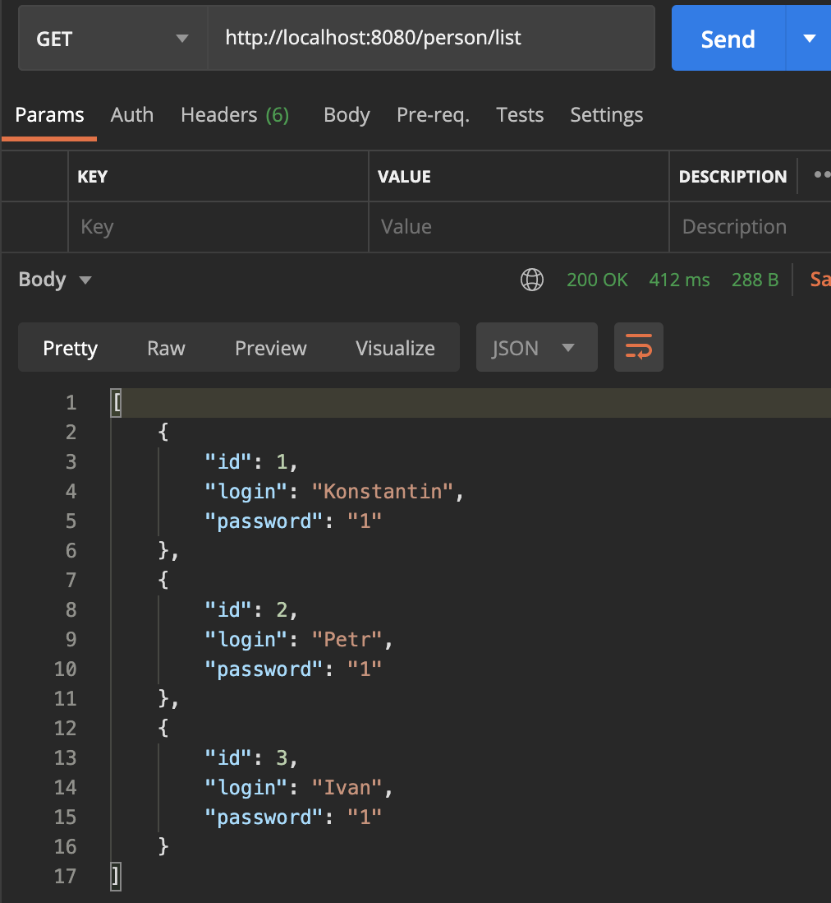
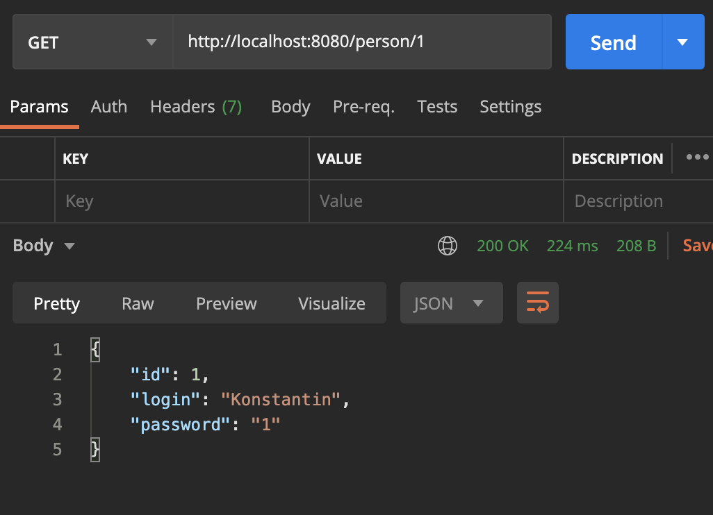
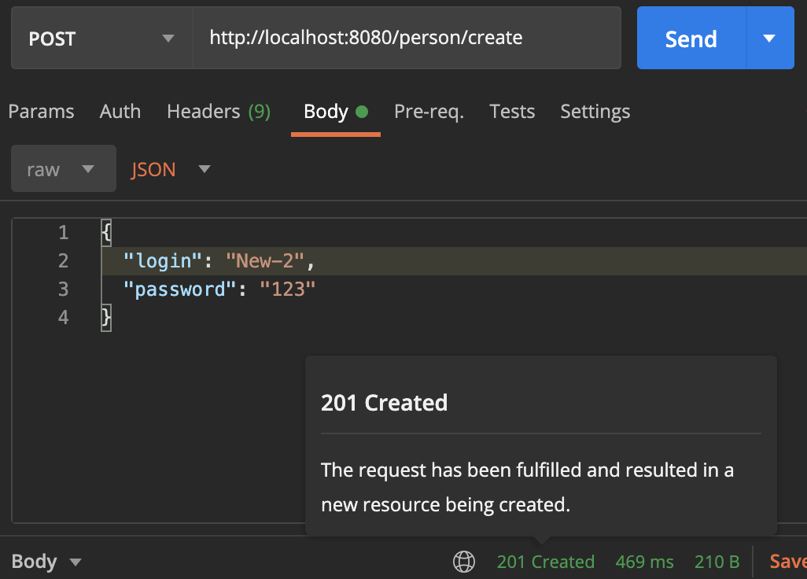
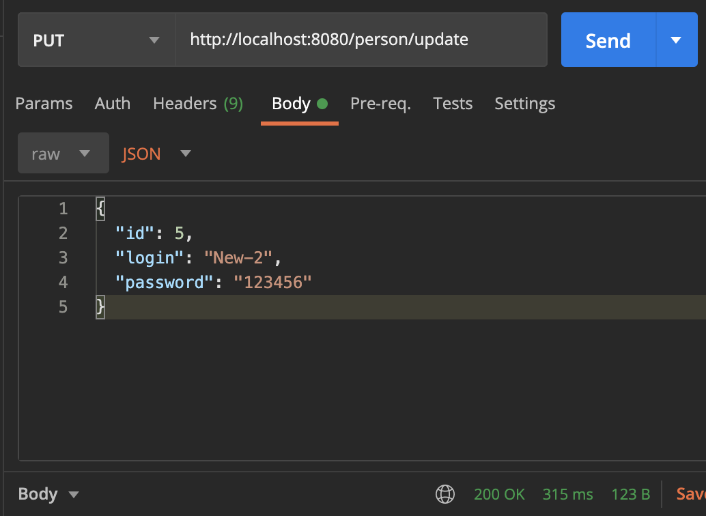
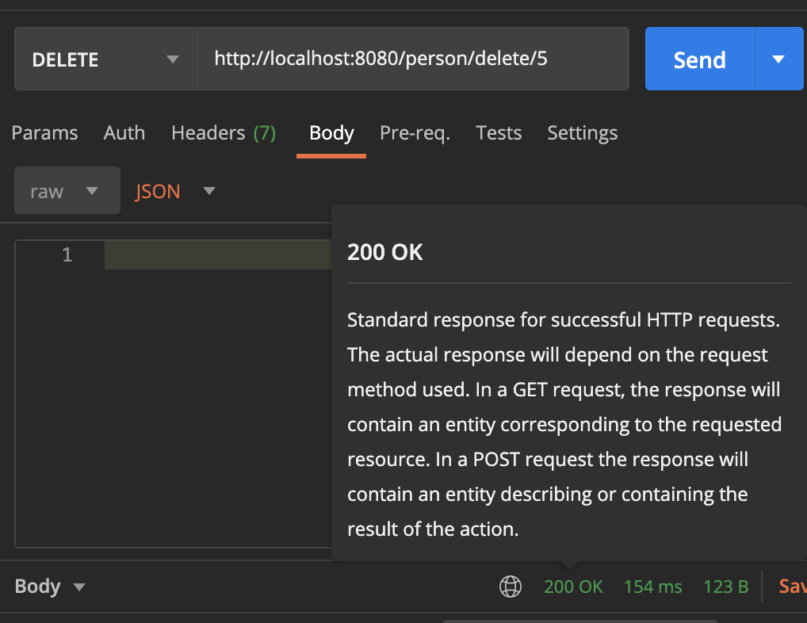

# job4j_auth
Проект Auth "Аутентификация"

[![github actions][actions-image]][actions-url]
[![coverage][codecov-image]][codecov-url]

Реализация REST API на Spring Boot для аутентификации пользователей.

### Используемые технологии
- Java 17
- Spring Boot 3.1.4
- Maven 3.8
- Git
- Lombok 1.18.22
- Junit 5

### Требуемое окружение
- JDK 17
- Apache Maven 3.8.5
- PostgreSQL 13
- Браузер

### Подготовка к запуску приложения
- Создать БД accidents хост `jdbc:postgresql://localhost:5432/fullstack_auth`
- Собрать jar с приложением, выполнив команду `mvn install`
- Запустить приложение из папки target, выполнив команду: `java -jar job4j_auth-1.0-SNAPSHOT.jar`

### Проверка сервисов
При помощи Postman вызвать сервисы.
Примеры:

#### http://localhost:8080/person/list

#### http://localhost:8080/person/{id}

#### http://localhost:8080/person/create

#### http://localhost:8080/person/update

#### http://localhost:8080/person/delete/{id}

### Контакты
kanmikhaylov@gmail.com

[actions-image]: https://github.com/kamikhaylov/job4j_auth/actions/workflows/maven.yml/badge.svg
[actions-url]: https://github.com/kamikhaylov/job4j_auth/actions/workflows/maven.yml
[codecov-image]: https://codecov.io/gh/kamikhaylov/job4j_auth/graph/badge.svg?token=
[codecov-url]: https://codecov.io/gh/kamikhaylov/job4j_auth